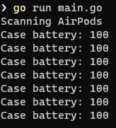

# go-airpods

Just experimenting with BLE (Bluetooth Low Energy) [Manufacturer Specific Data](https://docs.silabs.com/bluetooth/2.13/code-examples/stack-features/adv-and-scanning/adv-manufacturer-specific-data) from Airpods to show battery level from nearby AirPods.

## Prerequisites

You need to have Bluetooth enabled and Go 1.20 onwards to run this. This should work on Linux, Mac and Windows since the [underlying Bluetooth package](https://github.com/tinygo-org/bluetooth) supports these OSs.

## Running


```shell
go run main.go
```

If everything goes well when you open your AirPods case near your machine you will see the case battery like this:

